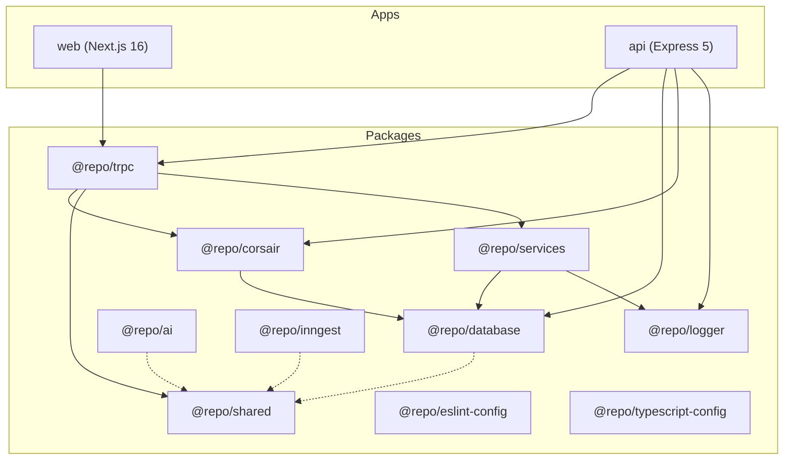

# Mailroid — Full Repository Analysis

## Overview

**Mailroid** is a monorepo email productivity app ("Your Mail App on Steroids") targeting a 6-day hackathon. It uses **pnpm workspaces + Turborepo** with 2 apps and 10 packages.

**Current state: Day 1 complete.** Authentication and Corsair tenant setup are working. The remaining core features (Gmail, Calendar, AI, Search, Briefings) are scaffolded but **entirely unimplemented**.

---

## Architecture Map



---

## Implementation Status

### ✅ Completed (Day 1)

| Component | Status | Details |
|-----------|--------|---------|
| Monorepo scaffolding | ✅ Done | pnpm + Turbo + 10 packages |
| PostgreSQL + Drizzle | ✅ Done | Docker, 2 migrations, schema exports |
| BetterAuth | ✅ Done | Google OAuth, session management |
| tRPC wiring | ✅ Done | Express adapter + OpenAPI + Scalar docs |
| Protected routes | ✅ Done | Client-side guard in `(protected)/layout.tsx` |
| Sign-in page | ✅ Done | Google sign-in → redirect to dashboard |
| Dashboard (stub) | ✅ Done | Shows email + logout button |
| Corsair core | ✅ Done | `createCorsair` with gmail + calendar plugins, multi-tenancy |
| Corsair tenant | ✅ Done | `getTenant(userId)` helper |
| shadcn/ui | ✅ Done | 53 components installed |
| Logger | ✅ Done | Winston with dev/prod formatting |

---

### 🔴 Not Implemented (0 bytes — empty files)

> [!WARNING]
> **27 files are completely empty** — all core feature logic is yet to be written.

#### Corsair Integration Layer (`packages/corsair/src/`)
| File | Purpose |
|------|---------|
| [connect.ts](file:///Users/lon3walker/Desktop/Web_Dev_Cohort/Fullstack/mailroid/packages/corsair/src/gmail/connect.ts) | Gmail OAuth connection |
| [get-email.ts](file:///Users/lon3walker/Desktop/Web_Dev_Cohort/Fullstack/mailroid/packages/corsair/src/gmail/get-email.ts) | Fetch emails |
| [send-email.ts](file:///Users/lon3walker/Desktop/Web_Dev_Cohort/Fullstack/mailroid/packages/corsair/src/gmail/send-email.ts) | Send emails |
| [search.ts](file:///Users/lon3walker/Desktop/Web_Dev_Cohort/Fullstack/mailroid/packages/corsair/src/gmail/search.ts) | Search emails |
| [create-event.ts](file:///Users/lon3walker/Desktop/Web_Dev_Cohort/Fullstack/mailroid/packages/corsair/src/calendar/create-event.ts) | Create calendar events |
| [get-events.ts](file:///Users/lon3walker/Desktop/Web_Dev_Cohort/Fullstack/mailroid/packages/corsair/src/calendar/get-events.ts) | Fetch calendar events |
| [invite.ts](file:///Users/lon3walker/Desktop/Web_Dev_Cohort/Fullstack/mailroid/packages/corsair/src/calendar/invite.ts) | Send calendar invites |
| [gmail.ts](file:///Users/lon3walker/Desktop/Web_Dev_Cohort/Fullstack/mailroid/packages/corsair/src/webhooks/gmail.ts) | Gmail webhook handler |
| [calendar.ts](file:///Users/lon3walker/Desktop/Web_Dev_Cohort/Fullstack/mailroid/packages/corsair/src/webhooks/calendar.ts) | Calendar webhook handler |

#### AI Package (`packages/ai/src/`)
| File | Purpose |
|------|---------|
| [executive-assistant.ts](file:///Users/lon3walker/Desktop/Web_Dev_Cohort/Fullstack/mailroid/packages/ai/src/agents/executive-assistant.ts) | Main AI agent |
| [system.ts](file:///Users/lon3walker/Desktop/Web_Dev_Cohort/Fullstack/mailroid/packages/ai/src/prompts/system.ts) | System prompt |
| [briefing.ts](file:///Users/lon3walker/Desktop/Web_Dev_Cohort/Fullstack/mailroid/packages/ai/src/prompts/briefing.ts) | Daily briefing prompt |
| [priority.ts](file:///Users/lon3walker/Desktop/Web_Dev_Cohort/Fullstack/mailroid/packages/ai/src/prompts/priority.ts) | Priority classification prompt |
| [generate.ts](file:///Users/lon3walker/Desktop/Web_Dev_Cohort/Fullstack/mailroid/packages/ai/src/embeddings/generate.ts) | Generate embeddings |
| [search.ts](file:///Users/lon3walker/Desktop/Web_Dev_Cohort/Fullstack/mailroid/packages/ai/src/embeddings/search.ts) | Vector search |
| All 4 tool files | Tool calling wrappers |
| [index.ts](file:///Users/lon3walker/Desktop/Web_Dev_Cohort/Fullstack/mailroid/packages/ai/src/index.ts) | Package entry |

#### Inngest (`packages/inngest/src/`)
| File | Purpose |
|------|---------|
| [client.ts](file:///Users/lon3walker/Desktop/Web_Dev_Cohort/Fullstack/mailroid/packages/inngest/src/client.ts) | Inngest client |
| [gmail-initial-sync.ts](file:///Users/lon3walker/Desktop/Web_Dev_Cohort/Fullstack/mailroid/packages/inngest/src/functions/gmail-initial-sync.ts) | Initial email sync |
| [email-received.ts](file:///Users/lon3walker/Desktop/Web_Dev_Cohort/Fullstack/mailroid/packages/inngest/src/functions/email-received.ts) | Webhook email handler |
| [email-embed.ts](file:///Users/lon3walker/Desktop/Web_Dev_Cohort/Fullstack/mailroid/packages/inngest/src/functions/email-embed.ts) | Embedding generation |
| [email-priority.ts](file:///Users/lon3walker/Desktop/Web_Dev_Cohort/Fullstack/mailroid/packages/inngest/src/functions/email-priority.ts) | Priority classification |
| [daily-brief-generate.ts](file:///Users/lon3walker/Desktop/Web_Dev_Cohort/Fullstack/mailroid/packages/inngest/src/functions/daily-brief-generate.ts) | Daily briefing |

#### Services (`packages/services/`)
| File | Purpose |
|------|---------|
| [gmail.service.ts](file:///Users/lon3walker/Desktop/Web_Dev_Cohort/Fullstack/mailroid/packages/services/server/gmail.service.ts) | Gmail business logic |

---

### 🟡 Missing from AGENTS.md Plan (not even scaffolded)

| Item | Where it should live |
|------|---------------------|
| `emails` table (with pgvector embedding) | `packages/database/models/` |
| `calendar_events` table | `packages/database/models/` |
| `daily_briefs` table | `packages/database/models/` |
| Gmail tRPC router | `packages/trpc/server/routes/gmail/` |
| Calendar tRPC router | `packages/trpc/server/routes/calendar/` |
| Assistant tRPC router | `packages/trpc/server/routes/assistant/` |
| Search tRPC router | `packages/trpc/server/routes/search/` |
| Settings page (Connect Accounts) | `apps/web/app/(protected)/settings/` |
| Inbox page | `apps/web/app/(protected)/inbox/` |
| Calendar page | `apps/web/app/(protected)/calendar/` |
| Assistant/Chat page | `apps/web/app/(protected)/assistant/` |
| Command palette component | `apps/web/components/command-palette/` |
| Inbox components | `apps/web/components/inbox/` |
| Calendar components | `apps/web/components/calendar/` |
| Assistant components | `apps/web/components/assistant/` |
| `ai` package.json | `packages/ai/package.json` — **does not exist** |
| `inngest` package.json | `packages/inngest/package.json` — **does not exist** |

---

## Code Quality Issues

### 🐛 Bugs & Errors

| Severity | File | Issue |
|----------|------|-------|
| 🔴 Critical | [page.tsx](file:///Users/lon3walker/Desktop/Web_Dev_Cohort/Fullstack/mailroid/apps/web/app/page.tsx#L5) | Calls `api.chaicode.query()` — **no `chaicode` route exists** in tRPC router. This page will crash. |
| 🔴 Critical | [get-session.ts](file:///Users/lon3walker/Desktop/Web_Dev_Cohort/Fullstack/mailroid/apps/web/hooks/get-session.ts#L4) | Calls `authClient.useSession()` with `await` — `useSession` is a React hook, can't be used outside components. |
| 🟡 Medium | [google-oauth.ts](file:///Users/lon3walker/Desktop/Web_Dev_Cohort/Fullstack/mailroid/packages/services/clients/google-oauth.ts#L5) | References `env.GOOGLE_OAUTH_CLIENT_ID` but env schema defines `GOOGLE_CLIENT_ID` / `GOOGLE_CLIENT_SECRET` — **property mismatch**. |
| 🟡 Medium | [index.ts](file:///Users/lon3walker/Desktop/Web_Dev_Cohort/Fullstack/mailroid/packages/corsair/src/index.ts#L7) | `console.log(corsairClient)` — debug log leaking into production. |
| 🟡 Medium | [route.ts](file:///Users/lon3walker/Desktop/Web_Dev_Cohort/Fullstack/mailroid/packages/trpc/server/routes/auth/route.ts#L13) | Route `getEmails` is in the auth router but has nothing to do with auth — it just returns session data. |
| 🟡 Medium | [server.ts](file:///Users/lon3walker/Desktop/Web_Dev_Cohort/Fullstack/mailroid/apps/api/src/server.ts#L18-L37) | References "Streamyst" throughout (old project name). Should be "Mailroid". |

### 🧹 Tech Debt

| Issue | Location |
|-------|----------|
| Hardcoded `localhost:3000` callback URL | [sign-in/page.tsx](file:///Users/lon3walker/Desktop/Web_Dev_Cohort/Fullstack/mailroid/apps/web/app/(auth)/sign-in/page.tsx#L9) |
| Hardcoded `localhost:8000` auth base URL | [auth-client.ts](file:///Users/lon3walker/Desktop/Web_Dev_Cohort/Fullstack/mailroid/apps/web/lib/auth-client.ts#L6) |
| Hardcoded `localhost:3000` trusted origin | [auth.ts](file:///Users/lon3walker/Desktop/Web_Dev_Cohort/Fullstack/mailroid/apps/api/src/auth/auth.ts#L12) |
| `.env` files duplicated across every package (same 411-byte file) | All packages have `.env` copied instead of using root dotenv |
| `@repo/services` env schema has mismatched field names vs usage | [env.ts](file:///Users/lon3walker/Desktop/Web_Dev_Cohort/Fullstack/mailroid/packages/services/env.ts) vs [google-oauth.ts](file:///Users/lon3walker/Desktop/Web_Dev_Cohort/Fullstack/mailroid/packages/services/clients/google-oauth.ts) |
| `staleTime: Infinity` in QueryClient | [global.tsx](file:///Users/lon3walker/Desktop/Web_Dev_Cohort/Fullstack/mailroid/apps/web/providers/global.tsx#L15) — emails will never refresh |
| Root package.json still named `trpc-monorepo` | [package.json](file:///Users/lon3walker/Desktop/Web_Dev_Cohort/Fullstack/mailroid/package.json#L2) |
| Metadata says "Streamyst" + "Media Forwarding" | [layout.tsx](file:///Users/lon3walker/Desktop/Web_Dev_Cohort/Fullstack/mailroid/apps/web/app/layout.tsx#L15-L18) |
| ZIP files committed to repo | `api.zip`, `database.zip`, `packages.zip`, `mailroid-main.zip`, `trpc-monorepo-main.zip` |
| `chatgpt.txt` in repo root (41KB) | Should be in `.gitignore` |
| Docker compose doesn't enable `pgvector` extension | [docker-compose.yml](file:///Users/lon3walker/Desktop/Web_Dev_Cohort/Fullstack/mailroid/docker-compose.yml) — uses `postgres:15`, needs `pgvector/pgvector:pg15` |

---

## Dependency Audit

### ✅ Healthy
- tRPC v11 — latest
- Express v5 — latest
- Drizzle ORM v0.45 — latest
- BetterAuth v1.6 — latest
- Next.js 16 — latest
- React 19 — latest
- Tailwind CSS v4 — latest

### ⚠️ Concerns
| Package | Issue |
|---------|-------|
| `@repo/shared` | Has `typescript: ^6.0.3` in devDeps — **TypeScript 6 doesn't exist yet** (likely a typo, should be `^5.9.3`) |
| `@repo/ai` | **No `package.json`** — this package is not a valid workspace member |
| `@repo/inngest` | **No `package.json`** — this package is not a valid workspace member |
| `@repo/services` | Missing `main`/`exports` fields in package.json |
| `zod` | Mixed versions: `^4.3.5` in some packages — Zod 4 is very new, verify API compatibility |

---

## Database Schema Assessment

### Currently Migrated
1. **BetterAuth tables**: `user`, `session`, `account`, `verification` — ✅ working
2. **Corsair tables**: `corsair_integrations`, `corsair_accounts`, `corsair_entities`, `corsair_events` — ✅ working

### Missing (per AGENTS.md spec)

```sql
-- emails table (needs pgvector)
CREATE TABLE emails (
  id TEXT PRIMARY KEY,
  user_id TEXT REFERENCES "user"(id),
  gmail_id TEXT,
  sender TEXT,
  subject TEXT,
  body TEXT,
  priority TEXT, -- 'urgent' | 'important' | 'later'
  received_at TIMESTAMP,
  embedding vector(1536) -- pgvector
);

-- calendar_events table
CREATE TABLE calendar_events (
  id TEXT PRIMARY KEY,
  user_id TEXT REFERENCES "user"(id),
  event_id TEXT,
  title TEXT,
  start_time TIMESTAMP,
  end_time TIMESTAMP
);

-- daily_briefs table
CREATE TABLE daily_briefs (
  id TEXT PRIMARY KEY,
  user_id TEXT REFERENCES "user"(id),
  date DATE,
  content TEXT
);
```

---

## Frontend Assessment

### Current Pages
| Route | Status |
|-------|--------|
| `/` | 🔴 Broken — calls non-existent `api.chaicode.query()` |
| `/sign-in` | ✅ Working — Google OAuth sign-in |
| `/dashboard` | 🟡 Minimal — just shows email + logout |

### Missing Pages (per AGENTS.md)
| Route | Purpose |
|-------|---------|
| `/inbox` | Priority inbox view |
| `/calendar` | Calendar events view |
| `/assistant` | AI chat interface |
| `/settings` | Connect Gmail/Calendar via Corsair |

### UI Component Library
53 shadcn/ui components installed — **extensive** and ready for building. Notable components available: `sidebar`, `command` (for command palette), `tabs`, `resizable` (for email split-pane), `calendar`, `sheet`, `dialog`.

---

## Prioritized Roadmap (Remaining ~5 Days)

### Day 2: Data Layer + Gmail Integration
1. Switch Docker to `pgvector/pgvector:pg15`
2. Create `emails`, `calendar_events`, `daily_briefs` Drizzle models
3. Add `package.json` for `@repo/ai` and `@repo/inngest`
4. Implement Corsair Gmail functions (`get-email`, `send-email`, `search`)
5. Build Gmail tRPC router
6. Fix broken home page

### Day 3: Calendar + Settings UI
1. Implement Corsair Calendar functions (`get-events`, `create-event`, `invite`)
2. Build Calendar tRPC router
3. Build Settings page with Corsair Connect Links
4. Build Inbox page UI (email list + reader pane)

### Day 4: AI + Vector Search
1. Implement embeddings (generate + search) with pgvector
2. Build Inngest functions (initial sync, email-embed, email-priority)
3. Implement priority classification
4. Build assistant tRPC router with tool calling

### Day 5: Chat + Daily Briefing
1. Build Executive Assistant agent with OpenAI
2. Build Assistant chat UI
3. Implement "Prepare Me For Today" daily briefing
4. Build Calendar page UI

### Day 6: Polish + Demo
1. Command palette
2. Keyboard shortcuts
3. Branding cleanup (Streamyst → Mailroid)
4. Error handling + loading states
5. Demo prep

---

## Quick Wins (< 30 minutes each)

1. Fix [page.tsx](file:///Users/lon3walker/Desktop/Web_Dev_Cohort/Fullstack/mailroid/apps/web/app/page.tsx) — redirect to `/dashboard` or `/sign-in`
2. Fix [get-session.ts](file:///Users/lon3walker/Desktop/Web_Dev_Cohort/Fullstack/mailroid/apps/web/hooks/get-session.ts) — remove the broken hook usage
3. Rename all "Streamyst" → "Mailroid" across the codebase
4. Remove `console.log(corsairClient)` from [corsair index](file:///Users/lon3walker/Desktop/Web_Dev_Cohort/Fullstack/mailroid/packages/corsair/src/index.ts)
5. Fix root package.json name from `trpc-monorepo` to `mailroid`
6. Add `.gitignore` entries or delete ZIP files and `chatgpt.txt`
7. Fix `staleTime: Infinity` to something reasonable for email data
